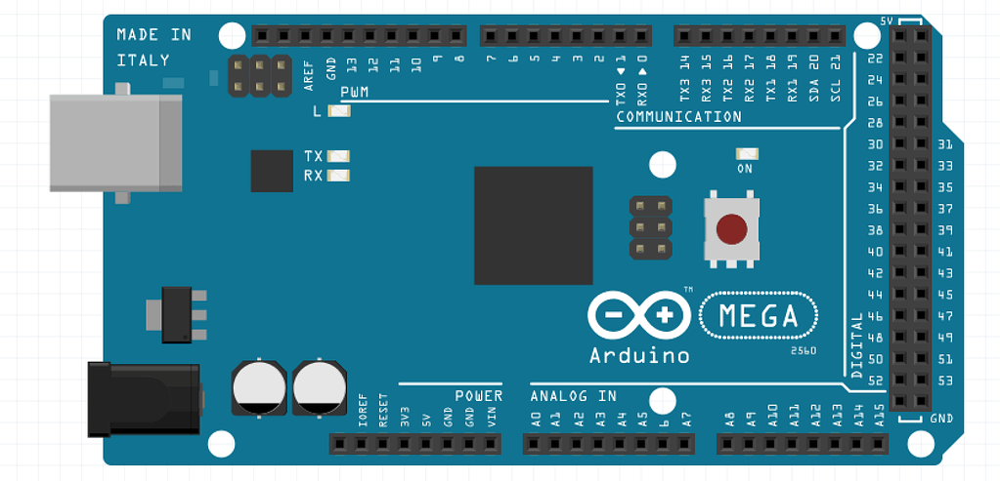

    

    

       
    

 *Updated: June 2022*

# SALCI

 SALCI is an acronym for:
 * **S**ensor 
 * **A**rray 
 * **L**ight 
 * **C**ontrolled 
 * **I**nstrument 

 SALCI is a novel musical instrument built using open source technology (Arduino). Music can be made using light and shadows. This post shows includes demo videos and build instructions.

# Demos of Making Music With SALCI

&nbsp

	

	  <iframe src="https://www.youtube.com/embed/SY_AKrlO8Dk" frameborder="0" allowfullscreen
	    style="position:absolute;top:0;left:0;width:100%;height:100%;"></iframe>
	

	

	

	  <iframe src="https://www.youtube.com/embed/x3eckIDz-VE" frameborder="0" allowfullscreen
	    style="position:absolute;top:0;left:0;width:100%;height:100%;"></iframe>
	

	

	

	  <iframe src="https://www.youtube.com/embed/LwjbtF24L3s" frameborder="0" allowfullscreen
	    style="position:absolute;top:0;left:0;width:100%;height:100%;"></iframe>
	

	

	

	  <iframe src="https://www.youtube.com/embed/zSLRRfacPqs" frameborder="0" allowfullscreen
	    style="position:absolute;top:0;left:0;width:100%;height:100%;"></iframe>
	

	

# Build Your Own & Source Code

SALCI runs on code that is open source and utilizes leverages [Arduino](http://arduino.cc) hardware.

In the spirt of open source I've am working on detailed build instructions, parts list, and source code on Github:


            
              <h4>
              <a href="https://github.com/dunhampa/SALCI" target="_blank">
                <i class="fa fa-github"></i>
                SALCI Source Code and Parts List On Github
              </a>
              </h4>
         


