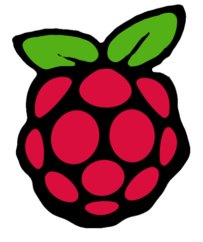

    

    

       
    

  

*Last Modified: May 21, 2021*

# Summary 

This page document the steps on getting a Raspberry Pi up from scratch and setting it up for screensharing to access from a laptop (in this case a Macbook Pro) using a VPN connection.

I used these steps to create some visual art from a [Raspberry Pi computer](https://en.wikipedia.org/wiki/Raspberry_Pi) and software called [Processing](https://processing.org/) . Here's the finished "product":

What is A PI?

&nbsp

[Raspberry Pis](https://en.wikipedia.org/wiki/Raspberry_Pi) (aka "Pis") are small and inexpensive computers that have a variety uses including teaching computing, IoT, and art. Because of there small size and low cost they Pis are perfect for creating and curating interative art. 

&nbsp

    

            
    

    

        
    

    

            
    

    

        
    

# Setting up the PI

## Step 1: Get the equipment

Get a Pi (mini computer) and needed auxillary items to get started. 

* **1:** Get or have a Raspberry PI: [For Example](https://www.raspberrypi.org/products/raspberry-pi-4-model-b/?variant=raspberry-pi-4-model-b-4gb)
* **2:** MicoSD card (I use 32 or 64GB): 
         

    

    

     
    

* **3:** If you have a Raspberry Pi 4 you will need micro HDMI to regard HDMI to connect to monitor. Adapters may have come with your Pi but if no you [can get them](https://www.amazon.com/gp/product/B00B2HORKE/ref=ppx_yo_dt_b_asin_title_o00_s00?ie=UTF8&psc=1) 
* **4:** A power adapter if not in your kit [get power](https://www.amazon.com/Raspberry-Power-Supply-USB-C-Listed/dp/B07W8XHMJZ/ref=sr_1_4?crid=224A2MQZYOJNJ&dchild=1&keywords=raspberry%2Bpi%2B4%2Badapter&qid=1613622754&sprefix=raspb%2Caps%2C182&sr=8-4&th=1)
* **5:** A computer with an way to read/write from a SD or microSD card (with adapter). The micro to standard SD adapter usually come with purchase of microSD 

* Raspberry Pi:

</a>

## Step 2: Get Etcher

* Go to: https://www.balena.io/etcher/
* Download Etcher for desired operating system.

</a>

## Step 3: Download the raw image

* Go to: https://www.raspberrypi.org/downloads/raspberry-pi-os/
* (For Mac) download the .zip file
* I chose "Raspberry Pi OS (32-bit) with desktop and recommended software"



## Step 4: Use Etcher to flash your microSD card

* Unzip downloaded file to an .img
* Insert card into computer
* Open Etcher it should see insert microSD
* Select image and flash card
* Flashing can take a few to many minutes, so be patient
* After flashing Etcher will validate the flash, this takes time to, so continue to be patient.

</a>

## Step 5: Boot ya PI

* Get card from your Mac/PC
* Physically insert microSD into PI as designed
* Plug in physical keyboard and mouse
* Plug in monitor
* Plug in the Pi

## Step 6: Walk through One Time Prompts

After the first boot there are some one-time prompt that guides some one time setups:
* Set Country
* Change password
* Setup Screen
* Select Wireless Network
* Update Software
* Restart once "Setup Complete"

## Step 7: Config Pi to Allow For Screen Sharing 

Continue

### **Get to *Raspberry PI Config*:**

From top left PI menu: PI -> Preferences -> Raspberry PI Config



**Turn VNC from GUI:**

From new window go to Interfaces tab. Flip the VNC toggle to "enabled".



**Setup remote user**

Open VNC Software from top right corner. Go to "User and Permissions"



**Setup remote password**

You have to setup a password to connect remotely - such as with Mac. 

If you don't set a password you won't be able to connect. So, set a password (remember it):



Make sure to set a password for MAC "Go To Server"

Open the command line and run:


sudo raspi-config


